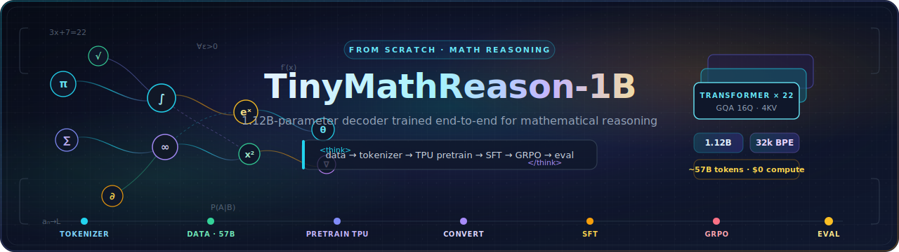

<p align="center">
  
</p>

<p align="center">
  <a href="https://opensource.org/licenses/Apache-2.0"></a>
  
  
  
  
</p>

# TinyMathReason-1B 🧮

**TinyMathReason-1B is a 1.12B-parameter decoder-only transformer trained from scratch for mathematical reasoning.**

The goal of this project is not just to ship a small math model, but to build and document the full end-to-end LLM stack: data curation, tokenizer training, TPU pretraining, checkpoint conversion, supervised fine-tuning, preference optimization, and evaluation. The repository is designed both as a reproducible engineering artifact and as a learning-focused reference for anyone studying how modern language models are built.

> **The honest headline:** TinyMathReason-1B scores 2.2% on GSM8K. That is roughly where peer 1B-class base models (TinyLlama-1.1B, Pythia-1B) land — and TinyLlama used ~50× more pretraining tokens. The point of this repo isn't the leaderboard. It's that **every stage of the pipeline was built and documented by hand**, from the tokenizer up through GRPO reinforcement learning, on **effectively zero out-of-pocket cost** using research-credit and trial programs.

## The pipeline at a glance

Seven stages, about 40 days of wall time, hybrid CPU/TPU/GPU infrastructure.

```text
┌──────────────┐   ┌────────────┐   ┌──────────────┐   ┌─────────────┐
│  TOKENIZER   │──▶│    DATA    │──▶│  PRETRAIN    │──▶│   CONVERT   │
│  32k BPE     │   │  ~57B tok  │   │  TPU v4-64   │   │ Orbax → HF  │
│  (1 day)     │   │  (3 days)  │   │  (~10 days)  │   │  (5 days!)  │
└──────────────┘   └────────────┘   └──────────────┘   └─────────────┘
                                                              │
       ┌──────────────────────────────────────────────────────┘
       ▼
┌──────────────┐   ┌────────────┐   ┌──────────────┐
│     SFT      │──▶│   GRPO     │──▶│  EVALUATE    │
│ AMD MI300X   │   │ 3 GPUs (!) │   │  lm-eval     │
│  (15h)       │   │  (13.5h)   │   │  + custom    │
└──────────────┘   └────────────┘   └──────────────┘
```

## Why this repo exists

Most open LLM projects only expose the final weights or a narrow slice of the training story. This repository aims to show the whole system:

- how a math-focused corpus is assembled and processed
- how a compact Llama-style architecture is chosen and justified
- how MaxText/JAX pretraining is run on TPUs
- how Orbax checkpoints are converted into Hugging Face format
- how SFT and DPO/GRPO are layered on top using PyTorch + TRL
- how each stage is evaluated and compared

If you are learning ML systems hands-on, this repo is meant to be useful as both code and documentation.

## What this repository includes

- tokenizer training code
- data download, cleaning, mixing, packing, and upload pipeline
- PyTorch reference model implementation
- TPU pretraining utilities and conversion scripts
- supervised fine-tuning code
- DPO / GRPO preference optimization code
- evaluation scripts and comparison helpers
- planning, architecture, and setup docs

## Model overview

TinyMathReason-1B uses a Llama-style decoder-only transformer optimized for compact reasoning workloads. The architecture deliberately mirrors TinyLlama so the **pipeline** stays the variable under test, not the model shape. The one intentional deviation is head dimension (128 instead of 64), following Llama-3's finding that wider heads capture richer relationships — useful when tracking variables across a derivation.

```text
                   TinyMathReason-1B
                   ════════════════
                       1.12B parameters

       Input tokens → [Embedding 32k × 2048]
                              │
                              ▼
            ┌─────────────────────────────────┐
            │  Transformer Layer × 22         │
            │  ┌───────────────────────────┐  │
            │  │ RMSNorm                   │  │
            │  │ ↓                         │  │
            │  │ GQA (16 Q heads, 4 KV)    │  │ ◄── 4:1 ratio
            │  │ ↓ + residual              │  │     shrinks KV cache 4×
            │  │ RMSNorm                   │  │
            │  │ ↓                         │  │
            │  │ SwiGLU MLP (5632 dim)     │  │
            │  │ ↓ + residual              │  │
            │  └───────────────────────────┘  │
            └─────────────────────────────────┘
                              │
                              ▼
                       [Final RMSNorm]
                              │
                              ▼
                       [LM Head 2048 × 32k]
                              │
                              ▼
                      Output logits
```

| Component | Value |
|---|---|
| Parameters | ~1.12B (exactly 1,123,117,056) |
| Layers | 22 |
| Hidden size | 2048 |
| Attention heads | 16 query heads |
| KV heads | 4 |
| Head dimension | 128 |
| Attention type | Grouped Query Attention (GQA 4:1) |
| MLP | SwiGLU |
| Intermediate size | 5632 |
| Context length | 4096 |
| Base vocab size | 32,000 |
| HF/export vocab size | 32,768 |
| Norm | RMSNorm |
| Positional encoding | RoPE |
| Precision | bfloat16 |

The three choices worth defending in a code review:

| Decision | Value | Why it's not the default |
|---|---|---|
| Attention | GQA 4:1 | 4 KV heads vs. 16 query heads — KV cache shrinks 4× at inference |
| Head dim | 128 (not 64) | Bigger heads capture richer relationships; matters for tracking math variables |
| Vocab | 32k padded to 32,768 | The padding to a power of 2 is for FSDP alignment, not vocab size |

Relevant code:
- `src/model/modeling_tinymath.py`
- `docs/architecture.md`

## Project status

Current pipeline progress (verified via `STATUS.md`):

- **Phase 1 COMPLETE:** Tokenizer training & pretraining corpus curation.
- **Phase 2 COMPLETE:** TPU pretraining (57B tokens) & Hugging Face conversion.
- **Phase 3 COMPLETE:** Post-Training SFT & comprehensive evaluation suite on AMD MI300X.
- **Phase 4 COMPLETE:** GRPO preference optimization on NVIDIA L4.

### Benchmark performance comparison

| Benchmark | Setting | Base Score | SFT Score | **GRPO Score (Final)** |
|---|---|:---:|:---:|:---:|
| **GSM8K** | 8-shot (Template-aligned) | 1.00% | 1.00% | **2.20%** (Flex) 🚀 |
| **Minerva Math** | 4-shot | 0.00% | 0.00% | **2.02%** (Verify) 🚀 |
| **ARC-Easy** | 0-shot | 29.90% | 25.51% | **28.79%** |
| **ARC-Challenge** | 25-shot | 21.70% | 24.66% | **22.78%** |
| **HellaSwag** | 10-shot | 25.80% | 26.70% | **26.30%** |
| **MMLU** | 5-shot | 23.50% | 24.60% | **23.62%** |

These results demonstrate that while a 1B model has limited absolute reasoning power, **GRPO successfully doubled math performance** over the SFT baseline through improved formatting and rule-based reinforcement.

## Training pipeline

The repo is structured around the same multi-stage workflow used for many modern LLMs.

### 1. Tokenizer training

A custom BPE tokenizer is trained on math-heavy text so the model can better represent formulas, symbols, and technical text efficiently. Reserved `<|im_start|>` / `<|im_end|>` for ChatML templating, with `<think>` / `</think>` saved for the SFT stage.

> **Lesson learned:** test multi-digit tokenization *before* you train. The shipped tokenizer chunks numbers inconsistently ("100" → 1 token, "2024" → 2 tokens, "1234567" → 3 chunks at arbitrary boundaries), which is the worst case for arithmetic. Pre-splitting digits (Llama-3, DeepSeek-Math) or a larger vocab (Qwen2.5 uses 151k) would have fixed it.

Main file:
- `src/data/train_tokenizer.py`

### 2. Data pipeline

The pretraining corpus is downloaded, cleaned, filtered, mixed, tokenized, packed, sharded, and uploaded for TPU training. The full pipeline ran in parallel across two Vultr `c2-standard-30` CPU nodes and produced ~1000 shards (~50MB compressed each) totaling **~57 billion tokens**.

```text
┌──────────────────────────────────────────────────────────────────┐
│                       DATA PIPELINE                              │
└──────────────────────────────────────────────────────────────────┘

   ┌────────────────┐
   │  a_download    │   Stream datasets from HuggingFace
   │                │   FineWeb-Edu | OpenWebMath | MathPile | Stack-Edu
   └───────┬────────┘
           │
           ▼
   ┌────────────────┐
   │ b_clean_filter │   word_count > 20, alpha_ratio > 0.3
   │                │   hash-based dedup
   └───────┬────────┘
           │
           ▼
   ┌────────────────┐
   │   c_mix        │   Weighted interleave, dataset folders → ratios
   │                │   Auto-normalizes from disk contents
   └───────┬────────┘
           │
           ▼
   ┌────────────────┐
   │ d_tokenize     │   Tokenize, concat with EOS,
   │ _and_pack      │   pack into 4096-token sequences
   └───────┬────────┘
           │
           ▼
   ┌────────────────┐
   │  e_shards      │   Split into ~50MB .jsonl.zst shards
   └───────┬────────┘
           │
           ▼
   ┌────────────────┐
   │  f_upload      │   rsync to GCS bucket for TPU consumption
   └────────────────┘
```

Pipeline files:
- `src/data/pipeline/a_download_datasets.py`
- `src/data/pipeline/b_clean_and_filter.py`
- `src/data/pipeline/c_mix_datasets.py`
- `src/data/pipeline/d_tokenize_and_pack.py`
- `src/data/pipeline/e_create_shards.py`
- `src/data/pipeline/f_upload_to_gcs.py`

> **The happy accident:** the mix was *meant* to include Proof-Pile-2 (15%), but a download-script oversight meant it was never fetched. The mixing script auto-normalized ratios from whatever was on disk, which concentrated high-quality math web data to 35% OpenWebMath (up from a planned 30%). A bug that improved the corpus.

### 3. Pretraining

Pretraining is run with MaxText on Google Cloud TPU v4-64 hardware (64 chips across 8 host VMs) via the **TPU Research Cloud** grant program. The repo includes configuration, monitoring, and preemption-handling utilities to support long-running preemptible TPU jobs.

```text
                       TPU v4-64 topology
                       ═══════════════════

              ┌──────┐ ┌──────┐ ┌──────┐ ┌──────┐
              │ Host │ │ Host │ │ Host │ │ Host │
              │  0   │ │  1   │ │  2   │ │  3   │
              │ 8 ch │ │ 8 ch │ │ 8 ch │ │ 8 ch │
              └──┬───┘ └──┬───┘ └──┬───┘ └──┬───┘
                 │        │        │        │
              ───┴────────┴────────┴────────┴───  high-speed mesh
                 │        │        │        │
              ┌──┴───┐ ┌──┴───┐ ┌──┴───┐ ┌──┴───┐
              │ Host │ │ Host │ │ Host │ │ Host │
              │  4   │ │  5   │ │  6   │ │  7   │
              └──────┘ └──────┘ └──────┘ └──────┘

         64 chips total. Single JAX distributed mesh.
         If one host reboots → entire mesh collapses.
```

Run stats:
- **Throughput:** ~8,900 tokens/sec/chip (~66 TFLOP/s/device)
- **Total tokens:** ~57 billion (54,362 steps)
- **Final loss:** ~2.6 (stable convergence)
- **Bill:** $0 out of pocket (TRC grant; ~$15k at spot, ~$50k at on-demand list)

> **The two flags that mattered more than anything else:**
> - `scan_layers: False` — on this MaxText/JAX/NNX stack, `True` silently produced checkpoints with **zero transformer layers**. One lost week.
> - `per_device_batch_size: 2` — `8` triggered XLA host-RAM allocations large enough to OOM the host during compilation.

Main files:
- `src/train/preemption_handler.py`
- `src/train/monitor_training.py`
- `docs/pretraining_setup.md`

### 4. Checkpoint conversion

The pretrained checkpoint is converted from Orbax/JAX format into Hugging Face-compatible safetensors. These are not just different file formats — they are different *tensor layouts* with different scaling conventions. Budgeted as one day, it took five.

```text
   MaxText/Orbax checkpoint               HuggingFace safetensors
   ════════════════════════               ═══════════════════════

   ┌──────────────────────┐               ┌──────────────────────┐
   │ params/              │               │ model.embed_tokens.  │
   │  decoder/            │               │   weight             │
   │   layers/            │               │ model.layers.0.      │
   │    self_attention/   │   convert     │   self_attn.q_proj.  │
   │     query/kernel ◄───┤   ────────▶   │   weight             │
   │     key/kernel       │               │ model.layers.0.      │
   │     value/kernel     │               │   self_attn.k_proj.  │
   │     out/kernel       │               │   weight             │
   │    mlp/...           │               │ ...                  │
   │  embedder/...        │               │                      │
   └──────────────────────┘               └──────────────────────┘
   ▲ Stacked layers in       ▲ Per-layer tensors. RoPE
     single array. Query       interleaving differs. Q
     scaling baked into        scaling applied at runtime.
     weights at save time.
```

The five bugs that ate the week:

1. **Vocab padding** — MaxText padded 32k → 32,768 for FSDP; HF needs `vocab_size=32768` explicit.
2. **Query scaling** — MaxText bakes `1/√head_dim` into Q weights at save time; HF applies it at runtime. Multiply Q weights by `√head_dim` during conversion or the scaling is applied twice.
3. **GQA tensor splitting** — Q (16 heads) and KV (4 heads) are stored stacked with the layer index as a dimension; careful slicing required.
4. **RoPE interleaving** — MaxText and HF use different rotary interleaving orders. Get it wrong and the model produces fluent, grammatical *nonsense*. Fix with a permutation.
5. **Tokenizer config** — `"tokenizer_class": "TokenizersBackend"` isn't a real class; `AutoTokenizer` failed silently. Use `"PreTrainedTokenizerFast"`.

> **Best advice here:** write the inspector *before* the converter. You will iterate 5–10 times, and each iteration is bearable only if you can see exactly what's in the source checkpoint.

Main files:
- `src/train/convert_checkpoint.py`
- `src/train/inspect_checkpoint.py`
- `src/train/verify_model.py`
- `src/eval/verify_hf.py`

### 5. Supervised fine-tuning

A two-stage post-training SFT curriculum on AMD MI300X (via the AMD Developer Cloud credits program):

- **Stage 1 (Conversational Prior):** ~52k Alpaca examples to align base output forms.
- **Stage 2 (Reasoning Traces):** resized token embeddings for `<think>` / `</think>`, then ~662k math examples (MetaMathQA ~395k + MathInstruct ~260k + GSM8K train ~7.5k), ChatML-wrapped, two epochs.

```text
              SFT data flow
              ═════════════

  Raw dataset (GSM8K, MathInstruct, MetaMathQA)
              │
              ▼
  ┌────────────────────────┐
  │ prepare_sft_data.py    │
  │  - extract Q & A       │
  │  - wrap reasoning in   │
  │    <think>...</think>  │
  │  - apply ChatML        │
  └────────────┬───────────┘
               │
               ▼
  ChatML-formatted text:
  ┌──────────────────────────────────────────────────┐
  │ <|im_start|>system                               │
  │ You are a math assistant...                      │
  │ <|im_end|>                                       │
  │ <|im_start|>user                                 │
  │ What's 12 × 13?                                  │
  │ <|im_end|>                                       │
  │ <|im_start|>assistant                            │
  │ <think>12 × 13 = 12 × 10 + 12 × 3 = 120 + 36 ... │
  │ </think>156<|im_end|>                            │
  └──────────────────────────────────────────────────┘
               │
               ▼
        SFTTrainer (TRL)
               │
               ▼
        Fine-tuned model
```

> **Three things worth changing next time:**
> - Set `assistant_only_loss=True` — otherwise loss is computed over the system prompt and user question too, wasting more than half of every gradient on boilerplate.
> - Initialize new token embeddings to the mean of existing rows (the Hewitt fix) instead of random normal — random init regressed ARC-Easy 29.9% → 25.5%.
> - Train math **first**, chat last. Reasoning is the goal, so give the chain-of-thought circuits the bulk of the gradient, then polish with broad chat.

Main files:
- `src/sft/prepare_sft_data.py`
- `src/sft/train_sft.py`
- `src/eval/run_custom_eval.py`
- `docs/sft_setup.md`

### 6. Preference optimization

The repo includes both DPO and GRPO training flows. **GRPO was chosen over DPO** because at ~1% SFT correctness, almost every preference pair would be "rejected vs. rejected" — no signal. GRPO works with absolute, rule-based rewards instead: generate G=8 completions per prompt, reward correctness + format, and reinforce above-average completions relative to the group mean. No value network, no critic.

```text
            GRPO in one diagram
            ═══════════════════

Prompt: "What's 12 × 13?"
                │
                ▼  generate G=8 different completions
         ┌──────────────────────────────────────────┐
         │ Completion 1: ... = 156  ✓  reward = 1.0 │
         │ Completion 2: ... = 144  ✗  reward = 0.0 │
         │ Completion 3: ... = 156  ✓  reward = 1.0 │
         │ Completion 4: ... = 169  ✗  reward = 0.0 │
         │ Completion 5: ... = 156  ✓  reward = 1.0 │
         │ Completion 6: ... = 130  ✗  reward = 0.0 │
         │ Completion 7: ... = 156  ✓  reward = 1.0 │
         │ Completion 8: ... = 156  ✓  reward = 1.0 │
         └─────────────────┬────────────────────────┘
                           │
                           ▼
         Mean reward in this group: 0.625
         Advantage per sample: reward - 0.625
                           │
                           ▼
         Reinforce above-average completions
         Suppress below-average completions
```

Hardened reward stack:
- AST-based correctness verification via `math_verify` (replaces brittle string matching)
- Strict binary regex format reward (1.0 / 0.0)
- N-gram repetition penalty to kill mode-collapse loops
- Explicit `<|im_end|>` stop-token injection to prevent conversation simulation
- Calibrated hyperparameters: G=8, β=0.01, lr=5e-6, cosine schedule, warmup=0.05

Main files:
- `src/dpo/generate_preferences.py`
- `src/dpo/train_dpo.py`
- `src/dpo/train_grpo.py`
- `docs/dpo_setup.md`

### 7. Evaluation

Evaluation scripts cover benchmark execution, custom evaluation, curve plotting, and model comparison across every stage (base → SFT → GRPO).

Main files:
- `src/eval/run_benchmarks.py`
- `src/eval/run_custom_eval.py`
- `src/eval/generate_comparison.py`
- `src/eval/plot_training_curves.py`
- `src/eval/modal_eval.py`

## Data mixture

The project combines general educational text with math-heavy data so the model learns both broad language structure and domain-specific mathematical patterns.

| Dataset | Share | Role |
|---|:---:|---|
| FineWeb-Edu | 40% | general educational web text |
| OpenWebMath | 35% | high-quality math web corpus |
| MathPile | 15% | curated math textbooks and papers |
| Stack-Edu | 10% | educational code |
| ~~Proof-Pile-2~~ | ~~15%~~ | *planned, never downloaded (the happy accident above)* |

The processed pretraining corpus is approximately 57B tokens in the currently documented completed run.

## Infrastructure used

This project spans multiple compute environments across the training lifecycle — and every piece of it was covered by a research-credit or trial program.

| Stage | Infrastructure | Funding |
|---|---|---|
| Tokenizer / local development | local machine | — |
| Data processing | 2× Vultr `c2-standard-30` nodes | $150 Vultr trial credit |
| Pretraining | Google Cloud TPU v4-64 | TPU Research Cloud grant |
| SFT | AMD MI300X (192GB VRAM) | AMD Developer Cloud credits |
| Preference generation | Modal | trial credits |
| Final evaluation / comparisons | Lightning AI + Thunder Compute | trial credits |

GRPO alone hopped across three different GPUs because of quota limits, resuming cleanly from checkpoints each time:

```text
        GRPO infrastructure migration
        ═════════════════════════════

  Steps 0 ────────── 12,500 ────────── 19,000 ────────── 22,419
        │              │                  │                │
        ▼              ▼                  ▼                ▼
  ┌──────────┐    ┌──────────┐      ┌──────────┐    ┌──────────┐
  │ AMD      │    │   HF     │      │ AMD      │    │  GCP     │
  │ MI300X   │ ─▶ │   Hub    │ ──▶  │ MI300X   │ ──▶│ 2× L4    │
  │ #1       │    │ (resume) │      │ #2       │    │ (CUDA)   │
  └──────────┘    └──────────┘      └──────────┘    └──────────┘
   quota out      checkpoint         vLLM/ROCm       ROCm→CUDA
   → SIGINT       backed up          conflicts       hop, works!
```

This makes the repo useful not only as a model-training project, but also as a practical example of hybrid infra orchestration across CPUs, TPUs, and GPUs — at near-zero cost.

## Repository layout

```text
.
├── README.md
├── STATUS.md
├── docs/
├── hf_1b_model/
├── hf_tiny_model/
├── src/
│   ├── data/
│   ├── dpo/
│   ├── eval/
│   ├── model/
│   ├── sft/
│   └── train/
└── Makefile
```

## Quick start

If you want to use a final Hugging Face checkpoint locally:

```python
from transformers import AutoModelForCausalLM, AutoTokenizer
import torch

model_id = "himanshunakrani9/TinyMathReason-1B-grpo"

tokenizer = AutoTokenizer.from_pretrained(model_id)
model = AutoModelForCausalLM.from_pretrained(
    model_id,
    torch_dtype=torch.bfloat16,
    device_map="auto"
)

prompt = "Solve the equation: 3x + 7 = 22"
messages = [{"role": "user", "content": prompt}]
inputs = tokenizer.apply_chat_template(
    messages,
    return_tensors="pt",
    add_generation_prompt=True,
).to(model.device)

outputs = model.generate(
    inputs,
    max_new_tokens=256,
    temperature=0.1,
)

print(tokenizer.decode(outputs[0], skip_special_tokens=True))
```

Released checkpoints on the Hugging Face Hub:
- SFT: [`himanshunakrani9/TinyMathReason-1B-sft`](https://huggingface.co/himanshunakrani9/TinyMathReason-1B-sft)
- GRPO: [`himanshunakrani9/TinyMathReason-1B-grpo`](https://huggingface.co/himanshunakrani9/TinyMathReason-1B-grpo)

If you only want to inspect the exported base checkpoint, see:
- `hf_1b_model/README.md`
- `hf_tiny_model/README.md`

## Reproducing the pipeline

Top-level commands:

- `make data` — run the full data processing pipeline
- `make pretrain` — TPU pretraining entrypoint / instructions
- `make sft` — prepare SFT data and launch fine-tuning
- `make dpo` — generate preferences and run DPO
- `make eval` — run benchmark and comparison scripts

Supporting docs:
- `docs/pretraining_setup.md`
- `docs/sft_setup.md`
- `docs/dpo_setup.md`
- `docs/vultr_setup.md`
- `docs/execution_plan.md`

## Why the pretrained baseline matters

One of the most instructive parts of this repository is that it does not hide the weak pretrained baseline. For a reasoning model, the jump from base pretraining to SFT and then to preference optimization is the story. Keeping the base metrics visible makes the later improvements measurable and honest.

That is especially valuable for:
- ML learners studying how capabilities emerge across stages
- researchers comparing post-training methods
- engineers who want a transparent end-to-end artifact instead of only polished final weights

## Intended use

TinyMathReason-1B is best understood as:

- a learning and portfolio project for end-to-end LLM systems
- a research artifact for small-model math reasoning experiments
- a starting point for instruction tuning and alignment experiments
- a reference repo for data → pretrain → post-train → eval workflows

It is not intended, in its current form, for:
- production deployment without substantial additional validation
- safety-critical decision making
- strong general-purpose assistant behavior in the base checkpoint

## Known limitations

- The released base model benchmark scores are still weak on reasoning-heavy tasks.
- The tokenizer chunks multi-digit numbers inconsistently, which caps arithmetic ability regardless of post-training.
- Pretraining packed documents without per-document attention masks, so attention can leak across concatenated documents in a sequence.
- Deduplication shipped as exact-string hashing rather than true MinHash, so near-duplicate web pages slipped through.
- Some documentation in the repo may describe earlier plans or older hardware assumptions; `STATUS.md` is the best snapshot of current progress.

## Suggested reading order

If you are new to the repository, this order works well:

1. `README.md`
2. `STATUS.md`
3. `docs/architecture.md`
4. `docs/pretraining_setup.md`
5. `src/train/convert_checkpoint.py`
6. `docs/sft_setup.md`
7. `src/eval/run_benchmarks.py`

For the full narrative write-ups, see the `writeups/` folder (Medium articles, technical report, and Twitter thread).

## Citation

```bibtex
@misc{tinymathreason2026,
  author = {Himanshu Nakrani},
  title = {TinyMathReason-1B: A 1.12B Parameter Mathematical Reasoning Model Built from Scratch},
  year = {2026},
  publisher = {GitHub},
  journal = {GitHub repository},
  howpublished = {\url{https://github.com/your-username/TinyMathReason-1B}}
}
```

## License

Apache 2.0
