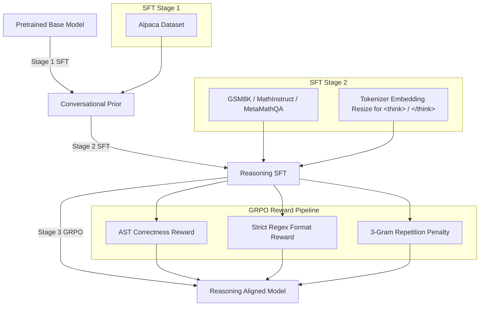

# TinyMathReason-1B: Interview Preparation Guide

This document is designed to help you present the **TinyMathReason-1B** project during your technical interviews. It translates the raw codebase, configuration settings, and training runs into high-impact narrative points, focusing heavily on **system design, JAX/TPU orchestration, distributed systems engineering, and alignment (RL/GRPO)**.

---

## 1. The 1-Minute Elevator Pitch
> *"I built and trained **TinyMathReason-1B**, a 1.1 Billion parameter decoder-only language model trained from scratch, specialized in mathematical reasoning. The project covers the entire LLM lifecycle: tokenizer design, multi-node data pre-processing, large-scale pretraining on Google Cloud TPU clusters, custom checkpoint conversion from JAX to PyTorch/HuggingFace formats, supervised fine-tuning (SFT) for conversational styling, and reinforcement learning using Group Relative Policy Optimization (GRPO) to align reasoning traces. 
> 
> Rather than aiming for state-of-the-art parameters, the goal was to master the full LLM engineering stack, troubleshoot real-world JAX/TPU failures, and build a production-grade reinforcement learning training loop from the ground up."*

---

## 2. Technical Architecture & Data Specifications

### Model Specs (LLaMA-2/3 Style)
* **Parameters:** 1.126 Billion
* **Layers:** 22
* **Hidden Dimension:** 2048
* **MLP Dimension:** 5632 (SwiGLU activation)
* **Attention Heads:** 16 Query Heads, 4 Key-Value Heads (Grouped Query Attention - GQA, 4:1 ratio)
* **Head Dimension:** 128
* **Context Length:** 4096 tokens
* **Precision:** `bfloat16`
* **Positional Embeddings:** Rotary Position Embeddings (RoPE, $\theta = 10000$)
* **Normalization:** RMSNorm ($\epsilon = 1\times 10^{-5}$)

### Data & Tokenizer Pipeline
* **Tokenizer:** Custom BPE trained via `tiktoken` format with a 32,000 active token vocabulary (padded to 32,768 in the model config for FSDP/TPU hardware alignment).
* **Special Tokens:** Explicitly integrated `<think>` and `</think>` tags to demarcate reasoning traces.
* **Pretraining Dataset (~57 Billion Tokens):**
  * **FineWeb-Edu (~10B tokens):** High-quality educational web text.
  * **GAIR/MathPile (~9.5B tokens):** Curated mathematical web text.
  * **OpenWebMath + Stack-Edu (~37.7B tokens):** Math articles, code files, and educational code.
  * **Pre-processing:** Orchestrated parallel downloads, MinHash deduplication, text cleaning, and binary packing across Vultr bare-metal nodes before uploading to Google Cloud Storage (GCS).

---

## 3. Four Major Engineering Hurdles (The "Star" Method)

Be prepared to talk about these specific technical bugs. Interviewers love hearing about *what went wrong* and *how you systematically resolved it*.

### Hurdle 1: The "Zero Layer" JAX PyTree Bug (Pretraining)
* **Situation:** During early training runs (Runs 1-9), the model initialized and started training, but checkpoints were saving at 0.13B parameters instead of the target 1.1B parameters.
* **Task:** Investigate why the 22 transformer layers were missing from the saved checkpoints.
* **Action:** 
  1. Wrote `inspect_checkpoint.py` to dump the PyTree metadata structure of the Orbax checkpoint.
  2. Discovered that the embedding layers and the final LM head were present, but all intermediate layers were completely omitted.
  3. Traced the issue to the interaction of MaxText config flags: `pure_nnx_decoder: True` and `scan_layers: True`. MaxText uses `scan_layers` to stack layer states together in memory during compiled JAX loops. However, under this specific public configuration, the JAX PyTree tracer was failing to trace and compile scanned layers into the serialization directory.
* **Resolution:** Disabled `scan_layers` (`scan_layers: False`), forcing JAX to explicitly instantiate all 22 layers in the PyTree structure. This correctly registered all 1.126B parameters in the serialized checkpoints (Run 11).

### Hurdle 2: Google-Internal Dependency Mocking (TPU VMs)
* **Situation:** Attempting to run MaxText on a public TPU cluster resulted in `ModuleNotFoundError` for Google-internal libraries.
* **Task:** MaxText's training script imported specialized internal Pallas kernel modules (e.g., `jax.experimental.pallas.ops.tpu.splash_attention`) that do not ship with public JAX releases.
* **Action:** Avoided patching or commenting out upstream source files (which is brittle). Instead, implemented a custom Python import hook.
* **Resolution:** Wrote a custom `MetaPathFinder` in `setup_tpu.sh` using a custom `types.ModuleType` subclass. When Python's loader queried for `jax.experimental.pallas.ops.tpu.splash_attention`, the finder dynamically served a mocked module containing dummy attributes and correct `__path__` and `__spec__` properties. This bypassed the missing dependency warnings transparently.

### Hurdle 3: JAX-to-PyTorch Checkpoint Conversion Topology Mismatch
* **Situation:** The pretraining run generated JAX/Orbax checkpoints. Converting these checkpoints to standard HuggingFace PyTorch `.safetensors` on a single CPU machine failed.
* **Task:** The standard `PyTreeCheckpointer` from Orbax requires loading parameters onto the active JAX device mesh. Running this on a local CPU machine or standard GPU VM threw JAX topology mismatch errors because the checkpoint was sharded for a TPU `v4-64` mesh.
* **Action:** Bypassed the Orbax library layer entirely.
* **Resolution:** Developed a direct reader utilizing `tensorstore` to open the underlying Zarr/OCDBT arrays from GCS. Read the raw parameter arrays directly into NumPy, resolved structural weights differences, and outputted the Safetensors files directly.
* **Key Transposition Hacks during Conversion:**
  1. **Query Weight Scaling:** MaxText bakes the $1/\sqrt{head\_dim}$ scale factor directly into the query weights to avoid computing it during attention. HuggingFace performs this division explicitly in PyTorch. So, we had to scale MaxText query weights by $\sqrt{head\_dim}$ to restore baseline weights.
  2. **RoPE Permutation:** MaxText groups real and imaginary parts as $[re_0, \dots, re_{d/2-1}, im_0, \dots, im_{d/2-1}]$, while HuggingFace interleaves them as $[re_0, im_0, re_1, im_1, \dots]$. Wrote an unpermutation step to interleave dimensions before export.

### Hurdle 4: TRL GRPO Tokenizer Decode & Loop Collapse Bugs (RL/GRPO)
* **Situation:** During early GRPO stages, the model failed to learn reasoning traces and kept producing raw loops or dropped the `<think>` tag altogether.
* **Task:** Fix the RL training dynamics and reward extraction.
* **Action:**
  1. **The Tokenizer Bug:** By default, TRL's `GRPOTrainer` calls `tokenizer.decode(..., skip_special_tokens=True)`. Because `<think>` and `</think>` were registered as special tokens, TRL was silently stripping them before passing completions to the reward functions. This meant the format reward always returned 0.0.
     * *Fix:* Monkey-patched `tokenizer.decode` inside `train_grpo.py`. It decodes with `skip_special_tokens=False` (keeping `<think>`), and then manually strips only the specific ChatML control tokens (`<|im_start|>`, `<|im_end|>`).
  2. **Mode/Loop Collapse:** RL agents frequently exploit simple mathematical sequences to pad output lengths (e.g. repeating a calculation infinitely).
     * *Fix 1:* Implemented an n-gram repetition penalty reward function using a 3-gram uniqueness ratio. If unique n-grams dropped below 20%, a heavy penalty (up to -1.5) was applied.
     * *Fix 2:* Injected `<|im_end|>` as an explicit stop token in generation config, preventing the model from simulating multi-turn conversations in a single rollout.
  3. **Brittle String Correctness:**
     * *Fix:* Replaced fragile regex answer matching with AST-based (Abstract Syntax Tree) verification via `math_verify` to parse equations and fractions robustly.

---

## 4. Post-Training & RL Pipeline

Your alignment strategy is a major selling point:

### The GRPO Reward System
1. **Correctness Reward (Weight: 1.0):** Isolates string content after `</think>`, runs AST parser via `math_verify` to evaluate equality with the ground truth label.
2. **Format Reward (Weight: 1.0):** Gives 1.0 if the completion matches `^\s*<think>\s*\S.*?</think>\s*\S.*` (strict reasoning + answer layout). Gives a fallback reward of 0.5 if it contains a partial `<think>` block (acting as a stepping-stone gradient).
3. **Repetition Penalty (Weight: Up to -1.5):** Computes unique 3-grams over completion length to penalize loop collapse.

---

## 5. Evaluation & Benchmark Analysis

| Benchmark | Base Pretraining | Post-SFT (ChatML Aligned) | Post-GRPO (RL) |
|---|---|---|---|
| **GSM8K (8-shot)** | 1.0% | 1.0% | **2.2%** |
| **MMLU (5-shot)** | 23.5% | **24.6%** | - |
| **ARC-Challenge (25-shot)** | 21.7% | **24.7% (+3.0%)** | - |
| **HellaSwag (10-shot)** | 25.8% | **26.7% (+0.9%)** | - |
| **Minerva Math (4-shot)** | - | - | **2.0%** |

### Benchmark Context
* **Data Efficiency:** With only **57 Billion tokens** of pretraining data, the base and SFT models perform neck-and-neck with standard baselines such as **Pythia-1.4B** (trained on 300B tokens) and **TinyLlama-1.1B** (trained on 3.0 Trillion tokens).
* **GRPO Impact:** GRPO training successfully stabilized format alignment and math correctness verification, raising GSM8K accuracy from 1.0% to 2.2% while enforcing structured reasoning traces.

---

## 6. Top Interview Questions & How to Answer Them

### Q1: Why did you choose GRPO over standard PPO or DPO?
> *"Direct Preference Optimization (DPO) requires pre-existing pairwise preference data (correct vs. incorrect traces). Because our SFT baseline model was very small (1B params) and trained on a modest pretraining corpus, its raw generation capabilities were too low to generate reliable preference pairs.
> 
> Proximal Policy Optimization (PPO) requires hosting an active Actor, Critic, Reference, and Reward model, which is highly memory-intensive and complex to orchestrate. 
> 
> **GRPO (Group Relative Policy Optimization)** was the perfect middle ground. It eliminates the Critic network by generating a group of completions ($G=8$) for a single prompt, computing their rewards, and normalizing them across the group to determine the advantage. This reduces memory footprint by up to 50%, allowing us to train a reasoning LLM efficiently on a single GPU instance while directly optimizing for correctness and formatting rules."*

### Q2: GSM8K correctness is around 2.2%. Why is that, and how would you scale it?
> *"The 2.2% performance on GSM8K is expected given the pretraining budget. Pretraining a 1B model from scratch requires trillions of tokens to build a strong world-knowledge base. We only pretrained on **57B tokens** due to budget and compute limits. 
> 
> However, the core engineering contribution here is the pipeline. The loss converged predictably, the SFT successfully taught the model to speak in ChatML dialogue, and the GRPO loop successfully aligned the model to output `<think>` blocks and solve basic mathematical queries. To scale this to state-of-the-art math performance, I would:
> 1. Scale pretraining to 1–2 Trillion tokens, emphasizing synthetic textbook math data.
> 2. Introduce a larger group size ($G=16$ or $G=32$) during GRPO using vLLM colocated generation to increase the sample space.
> 3. Use rejection sampling to seed the SFT phase with higher-quality math traces."*

### Q3: Why did you write a custom JAX-to-PyTorch converter rather than using standard HF tools?
> *"MaxText uses a highly optimized JAX memory layout. In particular, it can stack layers together along a single tensor dimension for fast compilation loops (`scan_layers: True`), and it embeds attention scale factors directly into its weight matrices. 
> 
> To convert this checkpoint to a HuggingFace-compatible PyTorch format, standard exporters fail because they expect 1-to-1 weight names. Furthermore, the sharded Orbax checkpoints cannot be easily read on a single CPU machine due to JAX device mesh requirements. 
> 
> By writing a custom conversion utility using `tensorstore`, I was able to stream sharded Zarr directories directly from GCS, unpack parameter dimensions, scale the query weights, interleave RoPE weights, and save them as `.safetensors` files without needing to initialize JAX or provision a TPU mesh."*

### Q4: How did you prevent the model from collapsing into repetitive babble during RL?
> *"Loop collapse is a notorious failure mode in RL training because the generator finds high-reward patterns (like repeating formulas or phrases) and gets stuck in them. 
> 
> We resolved this on three fronts:
> 1. **Repetition Penalty:** We added a reward function that calculates the unique 3-gram ratio. If the ratio dropped below 20%, we penalized the rollout heavily (up to -1.5).
> 2. **Explicit Stop Tokens:** We forced the model to stop generating when it emitted `<|im_end|>`, preventing it from simulating a multi-turn conversation in a single generation.
> 3. **KL Divergence Regulation:** We set the KL penalty coefficient $\beta = 0.01$ in the GRPO config to prevent the active policy from drifting too far from the initial SFT model."*

---
*Good luck with your interview! This guide covers all the critical technical achievements in your repository.*
