# Compute Resource Allocation Strategy (Max Benchmark Results)

This document provides a highly optimized resource allocation blueprint designed to extract the **absolute maximum benchmark performance** (GSM8K, MATH, MMLU) from our **TinyMathReason-1B** model, utilizing your exact pool of available compute credits.

***

## 1. Executive Allocation Blueprint

To achieve state-of-the-art reasoning capabilities for a 1.1B model, we must execute the full pipeline: **Base $\rightarrow$ SFT Stage 1 $\rightarrow$ SFT Stage 2 $\rightarrow$ DPO/GRPO $\rightarrow$ Evaluation**. We will distribute these phases across your assets based on their hardware strengths:

| Resource | Available Allocation | Optimal Assignment | Estimated Consumption |
| :--- | :--- | :--- | :---: |
| **AMD MI300X VM (AMD Cloud)** | **50 Hours** | **Post-Training SFT (Stage 1 & 2) + DPO/GRPO Training + Evaluation Runs** | **~18.5 Hours** (37% used) |
| **Modal (Serverless GPU)** | **\$30.00 Credits** | **vLLM Parallel Preference Candidate Generation (for DPO/GRPO)** | **~\$15.00** (50% used) |
| **Thunder Compute (GPU Cloud)**| **\$20.00 Credits** | **Development Sandboxing, Configuration Checks, and Backup Eval** | **~\$5.00** (25% used) |
| **Lightning AI (CPU/GPU Cloud)**| **\$10.00 Credits** | **Plotting Training Curves + Hosting Final Gradio Web Demo** | **~\$8.00** (80% used) |

***

## 2. Phase-by-Phase Execution Plan

By targeting the **full datasets** rather than subsets, we will secure the highest possible mathematical accuracy and conversational instruction-following capability.

### Phase A: SFT Stage 1 (Conversational Prior)
* **Compute**: AMD MI300X (192GB VRAM)
* **Dataset**: Full `tatsu-lab/alpaca` (52k instruction pairs)
* **Goal**: Enable general instruction-following, system prompts, and structured ChatML response formats.
* **Duration**: **~20 to 30 minutes** (0.5 hours) on MI300X.

### Phase B: SFT Stage 2 (Reasoning Traces with `<think>`)
* **Compute**: AMD MI300X (192GB VRAM)
* **Dataset**: **Full Reasoning Suite** (~660k examples: full GSM8K, full TIGER-Lab/MathInstruct, full meta-math/MetaMathQA)
* **Goal**: Maximize math capability by training the model to unroll extensive thinking steps inside `<think> ... </think>` tags before answering.
* **Duration**: **~10 to 12 hours** on MI300X. (The MI300X's 192GB VRAM and massive memory bandwidth allow massive batch sizes, completing this in a fraction of standard GPU times).

---

### Phase C: Preference Candidate Generation (For DPO/GRPO)
* **Compute**: **Modal (Serverless)**
* **Method**: To perform DPO (Direct Preference Optimization) or GRPO (Group Relative Policy Optimization), we must generate multiple math answers from our Stage 2 SFT model and classify them as *Chosen* (correct) or *Rejected* (incorrect).
* **Why Modal is Perfect**: Modal lets us spin up **dozens of parallel vLLM workers** instantly. We can feed 15,000 math prompts to the SFT model, generate 4 candidates per prompt, and auto-evaluate correctness in under 10 minutes.
* **Cost**: Running parallel serverless A10G/L4 instances on Modal for 10 minutes will cost **~\$12.00 to \$15.00**, leaving \$15.00 in reserve.

---

### Phase D: DPO/GRPO Alignment Training
* **Compute**: AMD MI300X (192GB VRAM)
* **Dataset**: The generated preference pairs from Modal (~15k pairs).
* **Goal**: Fine-tune the model to prefer rigorous, correct mathematical reasoning paths and penalize logical shortcuts, hallucinations, or format breaks.
* **Duration**: **~4 to 5 hours** of training on the MI300X.

---

### Phase E: Evaluation & Release
* **Compute**: AMD MI300X / Lightning AI
* **lm-evaluation-harness**: Run the benchmark scripts (`run_benchmarks.py`) directly on your MI300X VM during idle periods (takes **~10 minutes** per model stage).
* **Model Release & Gradio UI**: Use **Lightning AI**'s stable hosting to run a Python Gradio interface. A \$10.00 credit will comfortably host a 1.1B model CPU/light-GPU endpoint for several weeks, allowing you to showcase the model to the community!

***

## 3. Estimated Resource Burn & Cost Efficiency

Below is a breakdown of how much of your allocated budget remains after completing the training pipeline:

```mermaid
gantt
    title GPU Hour Consumption on AMD MI300X (50h Total)
    dateFormat  X
    axisFormat %H
    
    section MI300X Tasks
    Stage 1 SFT (Alpaca)          :active, 0, 1
    Stage 2 SFT (Full Math)       :active, 1, 13
    DPO/GRPO Alignment            :active, 13, 18
    Benchmark Evaluations         :18, 19
    Unused Spare Capacity        :crit, 19, 50
```

* **AMD MI300X Capacity**: **63% Remaining (31.5 Hours spare)**. You can use this to run additional ablation studies, train on different learning rates, or train a second run.
* **Modal Credits**: **\$15.00 Remaining**. Useful for generating additional test prompts or running batch inferences later.
* **Thunder Compute**: **\$15.00 Remaining**. Keep this as a general compute backup.

***

## 4. Immediate Action Item Checklist

1. [ ] **Spin up AMD MI300X VM** on AMD Cloud.
2. [ ] **Run SFT Stage 1 dataset prep** and execute Stage 1 training (35 min).
3. [ ] **Run SFT Stage 2 dataset prep** (Full Math Suite) and execute Stage 2 training (11 hours).
4. [ ] **Transition to Modal** to generate DPO reasoning traces.
