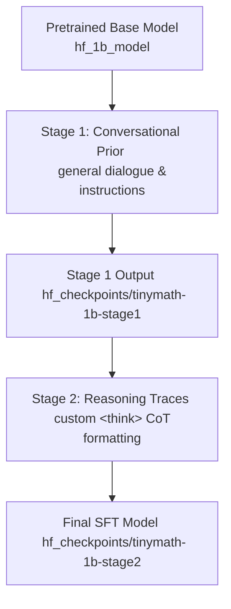

# Implementation Plan: Phase 3 (SFT & Evaluation)

This plan outlines the next steps to evaluate and fine-tune our pretrained **TinyMathReason-1B** model. Having successfully completed Phase 2 (Pretraining and Checkpoint Conversion), the model is verified, healthy, and ready for Stage 1 (Conversational Prior) and Stage 2 (Reasoning Traces) Supervised Fine-Tuning.

***

## 1. Executive Summary & Current State

### Completed Milestones ✅
1. **Tokenizer Creation**: Built a custom 32k tiktoken BPE tokenizer including special `<think>` and `</think>` tags.
2. **Pretraining**: Successfully trained a **1.126B parameter model** (22 layers, 2048 dim, 16 query heads) for 54,362 steps (~57 Billion tokens) on a TPU v4-64 cluster.
3. **Orbax to HuggingFace Conversion**: Decoupled the Orbax PyTree shards directly from GCS and converted them into Hugging Face `bfloat16` `.safetensors` model formats locally.
4. **Local CPU Model Verification**: We created and executed a local PyTorch verification script (`src/eval/verify_hf.py`) which loaded the converted weights in under a second on the CPU and successfully ran text generation, demonstrating a completely healthy architecture and attention layers!

> [!NOTE]
> Since this is a raw pretrained base model, its current text outputs are un-aligned (e.g., repeating prompts or generating random symbols). This is expected behavior and will be resolved by the SFT conversational prior phase.

***

## 2. Phase 3 Architecture: Two-Stage SFT Curriculum

To prevent our model from losing its general language capability while acquiring mathematical chain-of-thought (CoT) capabilities, we implement a **two-stage SFT curriculum** based on advanced reasoning alignment research:



### Stage 1: Conversational Prior
- **Objective**: Instill conversational structures, system prompts, and basic dialogue instructions so the model behaves as a cooperative chat assistant.
- **Dataset**: General high-quality conversational instruct data (e.g., `tatsu-lab/alpaca` or `no_robots`) formatted as ChatML messages *without* CoT traces.
- **Formatting**:
  ```json
  [
    {"role": "system", "content": "You are a helpful and polite mathematical assistant..."},
    {"role": "user", "content": "Instruction or prompt..."},
    {"role": "assistant", "content": "Direct, polite answer."}
  ]
  ```

### Stage 2: Reasoning Traces
- **Objective**: Infuse step-by-step reasoning chains. The assistant's answers are parsed so that the logic steps are wrapped in custom `<think>` and `</think>` tags.
- **Dataset**: `GSM8K`, `TIGER-Lab/MathInstruct`, and `meta-math/MetaMathQA`.
- **Vocabulary Change**: We pass `--resize_token_embeddings` to add `<think>` and `</think>` as active special tokens to the model (resizing the embedding matrix from 32,768 to 32,770).
- **Formatting**:
  ```json
  [
    {"role": "system", "content": "You are a mathematical reasoning assistant..."},
    {"role": "user", "content": "Solve: 12 + 15 ="},
    {"role": "assistant", "content": "<think>\nTo solve 12 + 15, we add the units: 2 + 5 = 7. Then the tens: 1 + 1 = 2.\n</think>\nThe answer is 27."}
  ]
  ```

***

## 3. Code Modifications & Configurations Added

To support this plan, we have updated and created the following files in the repository:

1. **`src/sft/prepare_sft_data.py`** (Rewritten):
   - Supports a `--stage` argument (1 or 2).
   - Stage 1 pulls `tatsu-lab/alpaca` and formats it into ChatML.
   - Stage 2 pulls math datasets, applies a robust `extract_cot_and_answer` parser to split thinking traces from the final answer, and wraps them in `<think>` tags.
2. **`src/sft/train_sft.py`** (Updated):
   - Accepts command-line overrides (`--model_path`, `--dataset_path`, `--output_dir`).
   - Supports `--resize_token_embeddings` to automatically resize the model's vocabulary and embed the custom reasoning tokens.
3. **SFT Stage YAML Configurations** (Created):
   - [sft_config_stage1.yaml](file:///Users/himanshu/Git/TinyMathReason-1B/src/sft/sft_config_stage1.yaml): Configured to train on Stage 1 data and output to `./sft_output/stage1`.
   - [sft_config_stage2.yaml](file:///Users/himanshu/Git/TinyMathReason-1B/src/sft/sft_config_stage2.yaml): Configured to read from Stage 1 outputs, resize token embeddings, train on Stage 2 data, and output to `./sft_output/stage2`.

***

## 4. Next Steps & Command Guide

Since fine-tuning a 1.1B model with full 4096 context sequence lengths requires GPU resources (such as an **AMD MI300X** 192GB or an NVIDIA A100/H100), you should run these steps on your GPU compute instance:

### Step 1: Clone and Setup GPU Environment
SSH into your GPU node and run:
```bash
# 1. Clone repository and enter directory
git clone <your-repo-url> TinyMathReason-1B
cd TinyMathReason-1B

# 2. Setup python virtual environment
python3 -m venv .venv
source .venv/bin/activate

# 3. Install PyTorch with appropriate compute support
# For AMD GPUs (ROCm):
pip install torch torchvision torchaudio --index-url https://download.pytorch.org/whl/rocm6.0
# For NVIDIA GPUs (CUDA):
pip install torch torchvision torchaudio

# 4. Install training and SFT dependencies
pip install transformers datasets trl peft accelerate deepspeed wandb pyyaml
```

### Step 2: Upload Converted Base Model
Upload your local converted model (`./hf_1b_model`) to your GCS bucket, or transfer it directly to the GPU instance under a directory named `hf_1b_model`.

### Step 3: Run SFT Data Preparation
Prepare the dataset splits for both stages of SFT:
```bash
# Stage 1: Conversational prior
python src/sft/prepare_sft_data.py --stage 1 --output_dir src/sft/sft_data/stage1_chat

# Stage 2: Reasoning traces
python src/sft/prepare_sft_data.py --stage 2 --output_dir src/sft/sft_data/stage2_reasoning
```

### Step 4: Execute SFT Training

First log into Weights & Biases to track training:
```bash
wandb login
```

Then, kick off **Stage 1 (Teach it to talk)**:
```bash
cd src/sft
accelerate launch train_sft.py \
    --config sft_config_stage1.yaml \
    --model_path ../../hf_1b_model \
    --dataset_path ./sft_data/stage1_chat \
    --output_dir ./sft_output/stage1
```

Next, run **Stage 2 (Teach it to think)**:
```bash
accelerate launch train_sft.py \
    --config sft_config_stage2.yaml \
    --model_path ./sft_output/stage1/final \
    --dataset_path ./sft_data/stage2_reasoning \
    --output_dir ./sft_output/stage2 \
    --resize_token_embeddings
```

### Step 5: Evaluate Training Stages
Run benchmarks on the Stage 1 and Stage 2 final models to trace improvement:
```bash
# Run benchmarks on Stage 1
python src/eval/run_benchmarks.py --model_path src/sft/sft_output/stage1/final --output_dir eval_results/stage1

# Run benchmarks on Stage 2
python src/eval/run_benchmarks.py --model_path src/sft/sft_output/stage2/final --output_dir eval_results/stage2
```
This wraps `lm-evaluation-harness` to run mathematical tasks (GSM8K, MATH) and outputs comparative summaries in `eval_results/`.

***

## 5. Verification Checklist

Use the following checkmarks to monitor your progress through Phase 3:

- [x] Converted checkpoint successfully verified locally on CPU.
- [ ] GPU instance provisioned and environment configured.
- [ ] Stage 1 and Stage 2 datasets generated on the instance.
- [ ] Stage 1 SFT completed (Conversational Prior, model follows instruction formats).
- [ ] Stage 2 SFT completed (Reasoning Traces, model outputs `<think>` tags).
- [ ] Evaluation benchmarks executed for both stages.
